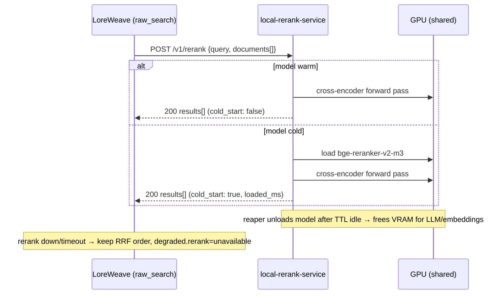

# local-rerank-service

Self-hosted **cross-encoder rerank API** for [LoreWeave](https://github.com/) raw search. Exposes a **Cohere-compatible** HTTP interface and manages GPU VRAM with lazy load, TTL auto-unload, and LRU eviction — so reranking can share one GPU with LM Studio, Ollama, and other local models.

**Status:** MVP running — FastAPI service, model lifecycle, and e2e smoke tests pass locally.

---

## Why this exists

LoreWeave hybrid search fuses bi-encoder (E5 / bge-m3) and lexical results with RRF. That works for ranking, but a **global cosine threshold cannot reject off-topic queries**: bi-encoder scores cluster in a narrow band (e.g. `[0.68, 0.82]`), so a junk query can score *above* a weak but valid paraphrase.

A **cross-encoder reranker** reads each `(query, passage)` pair jointly and produces well-separated relevance scores in `[0, 1]`. Neither LM Studio nor Ollama exposes a rerank endpoint, so reranking lives in this dedicated service that LoreWeave calls over HTTP.

| Layer | Role |
|---|---|
| Bi-encoder (E5 / bge-m3) | Fast candidate retrieval + RRF fusion |
| **This service** | Re-score top-N candidates; apply `min_rerank_score` floor |
| LoreWeave `raw_search` | Degrades to RRF order if reranker is down — search never 500s |

Full consumer contract: [docs/2026-06-08-rerank-service-integration.md](docs/2026-06-08-rerank-service-integration.md)

---

## Features (target)

- **Cohere-compatible** `POST /v1/rerank` — interoperable with Jina, Voyage, TEI, Infinity clients
- **On-demand VRAM** — lazy load on first request; auto-unload after idle TTL
- **VRAM budget** — cap resident models; LRU evict non-`keep_warm` models when tight
- **Bearer auth** — shared secret (`RERANK_SERVICE_TOKEN`), platform infra style
- **Block-and-load cold start** — hold request until model is ready (preferred UX for LoreWeave)
- **Self-hosted** — standard HTTP + JSON; no vendor lock-in

---

## Architecture



**Default model:** [`BAAI/bge-reranker-v2-m3`](https://huggingface.co/BAAI/bge-reranker-v2-m3) — 568M-param multilingual cross-encoder, strong on Chinese/CJK. Stored locally at `models/bge-reranker-v2-m3` (~2.1 GB on disk, ~1.1 GB VRAM with FP16).

**Inference stack:** FastAPI + `sentence-transformers` `CrossEncoder` + PyTorch CUDA.

---

## API surface (summary)

All endpoints require `Authorization: Bearer <RERANK_SERVICE_TOKEN>`.

| Method | Path | Purpose |
|---|---|---|
| `POST` | `/v1/rerank` | Score and rank documents by relevance to query |
| `GET` | `/v1/models` | List models and load state / TTL |
| `GET` | `/v1/models/{id}` | Single-model status |
| `POST` | `/v1/models/{id}/load` | Pre-warm model into VRAM |
| `POST` | `/v1/models/{id}/unload` | Evict model now |
| `GET` | `/health` | Liveness |
| `GET` | `/ready` | Process up (0 models loaded is OK) |

Example rerank request:

```json
{
  "model": "bge-reranker-v2-m3",
  "query": "主角第一次开启神武印记的经过",
  "documents": ["张若尘睁开双眼……", "他在武市买了一把剑……", "量子计算机……"],
  "top_n": 30,
  "return_documents": false
}
```

Example response:

```json
{
  "model": "bge-reranker-v2-m3",
  "results": [
    { "index": 0, "relevance_score": 0.985 },
    { "index": 1, "relevance_score": 0.122 },
    { "index": 2, "relevance_score": 0.004 }
  ],
  "meta": { "cold_start": false, "loaded_ms": 0, "scored": 3 }
}
```

See the [integration doc](docs/2026-06-08-rerank-service-integration.md) for error codes, TTL semantics, and LoreWeave wiring.

---

## Prerequisites

- **OS:** Windows (setup scripts are PowerShell; Linux deploy TBD)
- **[uv](https://docs.astral.sh/uv/)** for isolated Python env (`uv --version`)
- **NVIDIA GPU** + driver (PyTorch CUDA 12.4 wheels bundle the runtime)
- **Model weights** in `models/bge-reranker-v2-m3` (not committed to git)

> Use the project **`.venv` (Python 3.12)** — do not run against a messy system Python 3.13.

---

## Quick start

### 1. Clone and download model

Model weights are gitignored. Download once:

```powershell
uv venv --python 3.12 .venv
.\.venv\Scripts\python.exe -c "from huggingface_hub import snapshot_download; snapshot_download('BAAI/bge-reranker-v2-m3', local_dir='models/bge-reranker-v2-m3')"
```

Or copy an existing `models/bge-reranker-v2-m3` folder into the repo.

### 2. Install environment

```powershell
.\scripts\setup.ps1
```

Or manually:

```powershell
uv venv --python 3.12 .venv
uv sync
.\.venv\Scripts\python.exe .\scripts\verify_env.py
```

### 3. Configure `.env`

```powershell
Copy-Item .env.example .env
```

Edit `.env` — at minimum set a real `RERANK_SERVICE_TOKEN`. Default listen address:

```
http://127.0.0.1:28417
```

### 4. Run the service

```powershell
.\scripts\run_server.ps1
# or: .\.venv\Scripts\python.exe -m app.main
```

Service listens at `http://127.0.0.1:28417` (see `RERANK_HOST` / `RERANK_PORT` in `.env`).

### 5. E2E smoke test

With the server running:

```powershell
.\.venv\Scripts\python.exe .\scripts\e2e_test.py
```

### 6. Verify GPU

```powershell
.\.venv\Scripts\python.exe -c "import torch; print(torch.cuda.is_available(), torch.cuda.get_device_name(0))"
```

Expected: `True` and your GPU name (e.g. `NVIDIA GeForce RTX 4090`).

---

## Configuration

| Variable | Default | Description |
|---|---|---|
| `RERANK_HOST` | `0.0.0.0` | Bind address |
| `RERANK_PORT` | `28417` | Listen port (chosen to avoid common dev ports) |
| `RERANK_SERVICE_TOKEN` | — | Bearer secret (**required**) |
| `RERANK_DEFAULT_TTL` | `600` | Idle seconds before auto-unload |
| `RERANK_REAPER_INTERVAL` | `30` | Background reaper tick (seconds) |
| `RERANK_VRAM_BUDGET_MB` | `4096` | Max total resident reranker VRAM |
| `RERANK_MAX_LOADED` | `1` | Max concurrently loaded models |
| `RERANK_MODELS` | `bge-reranker-v2-m3` | Allowlist of servable model IDs |
| `RERANK_MODEL_PATH` | `./models/bge-reranker-v2-m3` | Local path for default model |

`.env` is gitignored; `.env.example` is the template.

---

## Project layout

```
local-rerank-service/
├── app/
│   ├── main.py                 # FastAPI entrypoint
│   ├── config.py               # pydantic-settings from .env
│   ├── model_manager.py        # lazy load, TTL reaper, scoring
│   └── routers/                # health, models, rerank
├── docs/
│   └── 2026-06-08-rerank-service-integration.md   # API contract (provider + consumer)
├── models/
│   ├── .gitkeep
│   └── bge-reranker-v2-m3/                        # weights (gitignored)
├── scripts/
│   ├── setup.ps1                                  # one-shot env setup
│   ├── run_server.ps1                             # start uvicorn
│   ├── e2e_test.py                                # API smoke test
│   └── verify_env.py                              # GPU + import sanity check
├── .env.example
├── pyproject.toml                                 # deps; torch from CUDA 12.4 index
├── uv.lock
└── README.md
```

---

## Tech stack

| Component | Choice |
|---|---|
| API | FastAPI + Uvicorn |
| Reranker | `sentence-transformers` `CrossEncoder` |
| Model | `BAAI/bge-reranker-v2-m3` (safetensors, FP16 at runtime) |
| ML runtime | PyTorch 2.6 + CUDA 12.4 |
| Env manager | [uv](https://docs.astral.sh/uv/) + Python 3.12 |

Dependency versions are pinned in `pyproject.toml` / `uv.lock` for reproducible Windows installs (notably `numpy`, `pandas`, `pyarrow`, `sentence-transformers`).

---

## LoreWeave integration (consumer side)

Rerank sits **after RRF fusion** in `raw_search`:

1. Take fused top-N (e.g. 30) candidates
2. `POST /v1/rerank` with query + snippet text
3. Re-sort by `relevance_score`; set hit `relevance` to cross-encoder score
4. Apply `min_rerank_score` floor → `cap_per_chapter` → `[:limit]`

LoreWeave config keys (consumer repo): `RERANK_URL`, `RERANK_SERVICE_TOKEN`, `RERANK_MODEL_REF`, `RERANK_TOP_N`, `MIN_RERANK_SCORE`, `RERANK_ENABLED`, warm/cold timeouts.

If reranker is unavailable, LoreWeave **keeps RRF order** and sets `degraded["rerank"] = "unavailable"`.

---

## Roadmap

- [x] Integration contract drafted
- [x] Model weights downloaded locally
- [x] Isolated Python 3.12 + CUDA PyTorch environment
- [x] `.env` / port configuration
- [x] FastAPI app + Cohere-compatible `/v1/rerank`
- [x] `ModelManager` (lazy load, TTL reaper, LRU eviction)
- [x] Model management endpoints (`/v1/models`, load/unload)
- [x] Health endpoints + bearer auth middleware
- [x] E2E smoke test (`scripts/e2e_test.py`)
- [ ] LoreWeave integration + `min_rerank_score` calibration eval

---

## License

See [LICENSE](LICENSE).
